# 🔗 Serverless URL Shortener on AWS Lambda

A production-ready Bitly-style URL shortening service built entirely on AWS serverless architecture.

[](http://your-s3-url.com)
[](https://aws.amazon.com)
[](https://python.org)

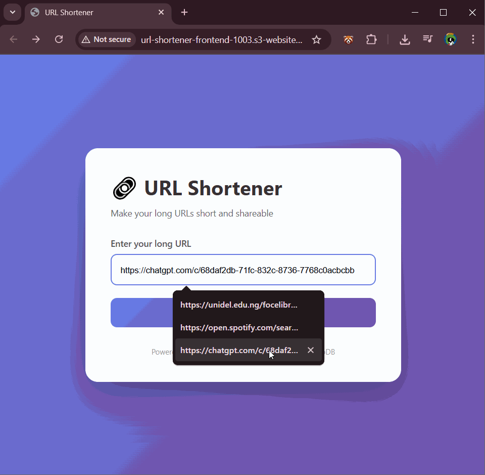

---

## 🎯 Project Overview

Built a scalable, cost-effective URL shortening service to learn AWS serverless architecture, RESTful API design, and full-stack development on the cloud.

**Live Application:** [http://your-s3-url.com](https://url-shortener-frontend-1003.s3.us-east-1.amazonaws.com/index.html]([http://your-s3-url.com](https://url-shortener-frontend-1003.s3.us-east-1.amazonaws.com/index.html))

---

## 🏗️ Architecture

```
┌─────────────┐      ┌──────────────┐      ┌─────────────┐      ┌──────────────┐
│   Client    │─────▶│ API Gateway  │─────▶│   Lambda    │─────▶│  DynamoDB    │
│ (S3 Static) │      │    (REST)    │      │  (Python)   │      │  (NoSQL DB)  │
└─────────────┘      └──────────────┘      └─────────────┘      └──────────────┘
       │                     │                     │                     │
       │                     │                     │                     │
       └────── Request ──────┴───── Process ──────┴─── Store/Retrieve ─┘
```


### Tech Stack

**Frontend:**
- HTML5, CSS3, Vanilla JavaScript
- S3 Static Website Hosting
- Responsive design with gradient UI

**Backend:**
- **AWS Lambda** - Serverless compute (Python 3.9)
- **API Gateway** - RESTful API endpoints
- **DynamoDB** - NoSQL database for URL mappings
- **IAM** - Role-based access control
- **CloudWatch** - Logging and monitoring

---

## ✨ Features

-  **Generate short URLs** - Random 6-character alphanumeric codes
-  **Collision handling** - Automatic retry with exponential backoff
-  **Fast redirects** - 301 permanent redirects with <100ms latency
-  **Click analytics** - Track clicks and last access timestamps
-  **CORS enabled** - Cross-origin requests supported
-  **Scalable** - Auto-scales with AWS serverless architecture
-  **Cost-efficient** - $0/month on AWS Free Tier

---

## 📡 API Documentation

### Base URL
```
(https://5c0xe600v5.execute-api.us-east-1.amazonaws.com/prod)
```

### Endpoints

#### 1. Shorten URL
```http
POST /shorten
Content-Type: application/json

{
  "url": "https://www.example.com/very/long/url"
}
```

**Response (201 Created):**
```json
{
  "shortCode": "a1b2c3",
  "shortUrl": "https://api-url.com/prod/a1b2c3",
  "longUrl": "https://www.example.com/very/long/url"
}
```

#### 2. Redirect to Long URL
```http
GET /{shortCode}
```

**Response:** 301 Redirect to original URL

---

## 🗄️ Database Schema

**DynamoDB Table:** `UrlShortener`

| Field | Type | Description |
|-------|------|-------------|
| `shortCode` | String (PK) | Unique 6-char identifier |
| `longUrl` | String | Original URL |
| `clicks` | Number | Redirect count |
| `createdAt` | Number | Unix timestamp |
| `lastAccessed` | Number | Last redirect timestamp |

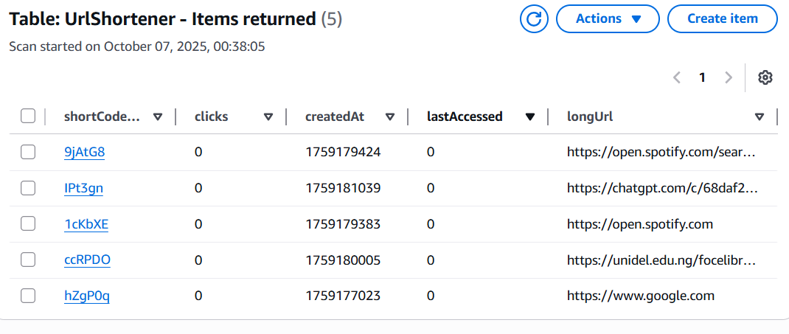

---

## 🚀 Deployment Guide

### Prerequisites
- AWS Account with IAM user (non-root)
- AWS CLI configured
- Python 3.9+

### Step 1: Create DynamoDB Table
```bash
aws dynamodb create-table \
    --table-name UrlShortener \
    --attribute-definitions AttributeName=shortCode,AttributeType=S \
    --key-schema AttributeName=shortCode,KeyType=HASH \
    --billing-mode PAY_PER_REQUEST \
    --region us-east-1
```

### Step 2: Create IAM Role
1. Create role for Lambda with trust policy
2. Attach `AWSLambdaBasicExecutionRole`
3. Add inline policy for DynamoDB access (PutItem, GetItem, UpdateItem)

### Step 3: Deploy Lambda Function
```bash
# Package code
zip deployment.zip lambda_function.py

# Deploy
aws lambda create-function \
    --function-name urlShortenerFunction \
    --runtime python3.9 \
    --role arn:aws:iam::ACCOUNT_ID:role/lambda-url-shortener-role \
    --handler lambda_function.lambda_handler \
    --zip-file fileb://deployment.zip \
    --environment Variables={TABLE_NAME=UrlShortener}
```

### Step 4: Configure API Gateway
1. Create REST API
2. Create resources: `/shorten` (POST), `/{code}` (GET)
3. Enable Lambda Proxy Integration
4. Enable CORS
5. Deploy to `prod` stage

### Step 5: Deploy Frontend to S3
1. Create S3 bucket
2. Enable static website hosting
3. Upload `index.html`
4. Set bucket policy for public read access
5. Update API URL in JavaScript

**Detailed instructions:** See [DEPLOYMENT.md](DEPLOYMENT.md)

---

## 🧪 Testing

### Test with cURL
```bash
# Shorten URL
curl -X POST https://YOUR-API-URL/prod/shorten \
  -H "Content-Type: application/json" \
  -d '{"url":"https://github.com"}'

# Test redirect
curl -I https://YOUR-API-URL/prod/abc123
# Should return 301 with Location header
```


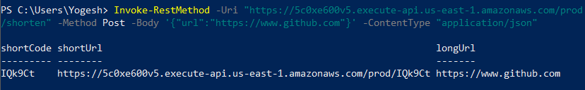

---

## 📊 Performance & Metrics

- **Average Latency:** ~80ms for shortening, ~50ms for redirects
- **Throughput:** Handles 1000+ req/sec (Lambda auto-scaling)
- **Availability:** 99.9% (AWS SLA)
- **Cost:** $0.00/month for <1M requests (Free Tier)

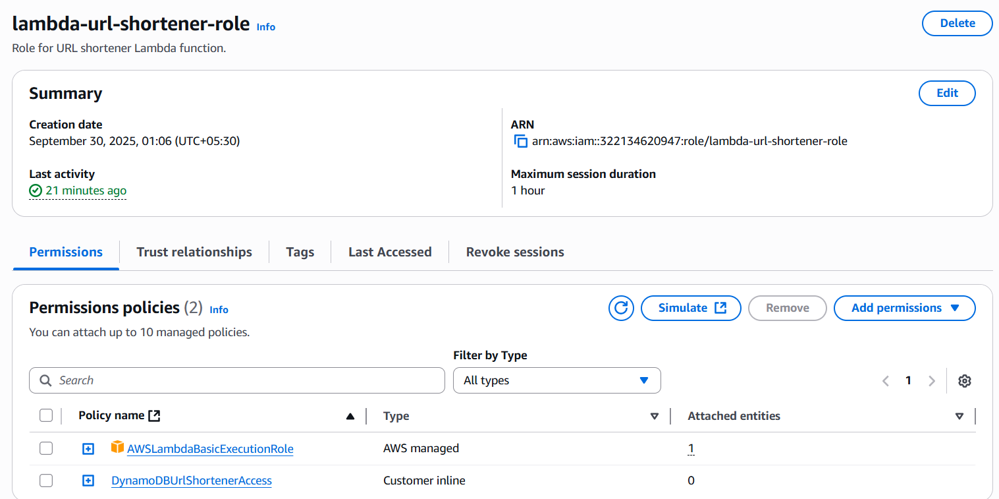

---

## 📸 Screenshots

### Lambda Function Code
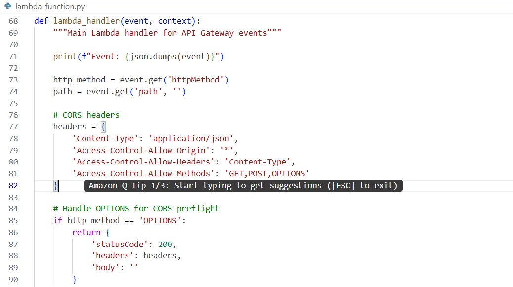
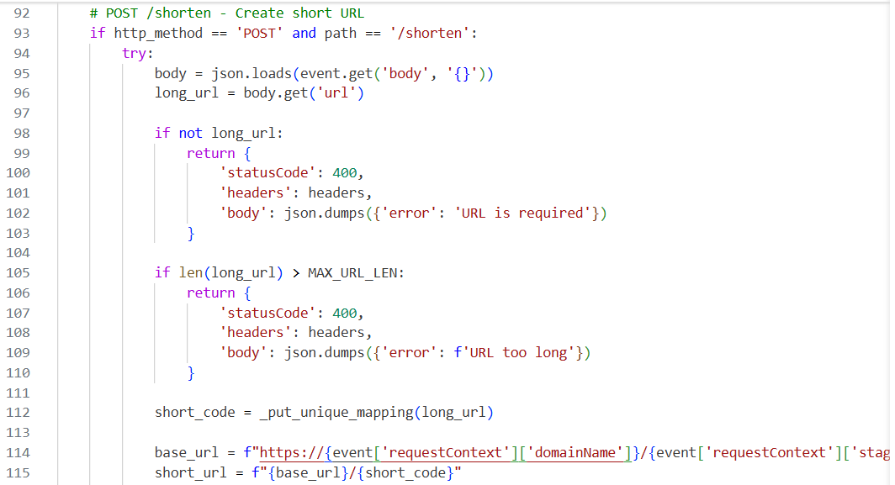
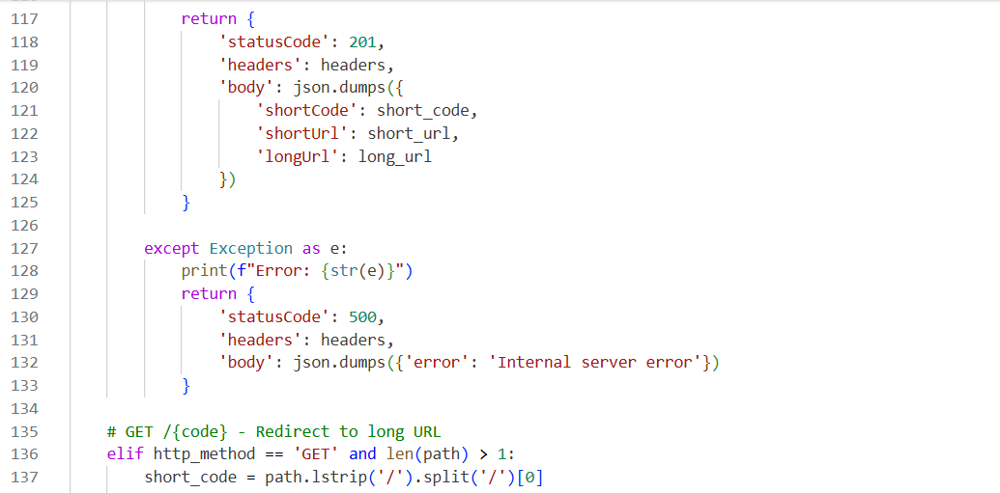
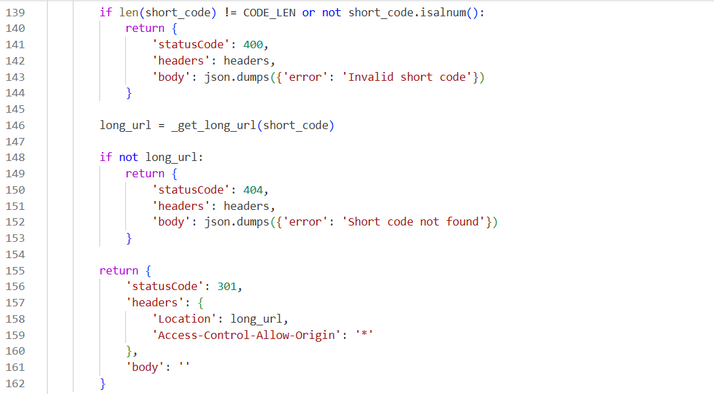
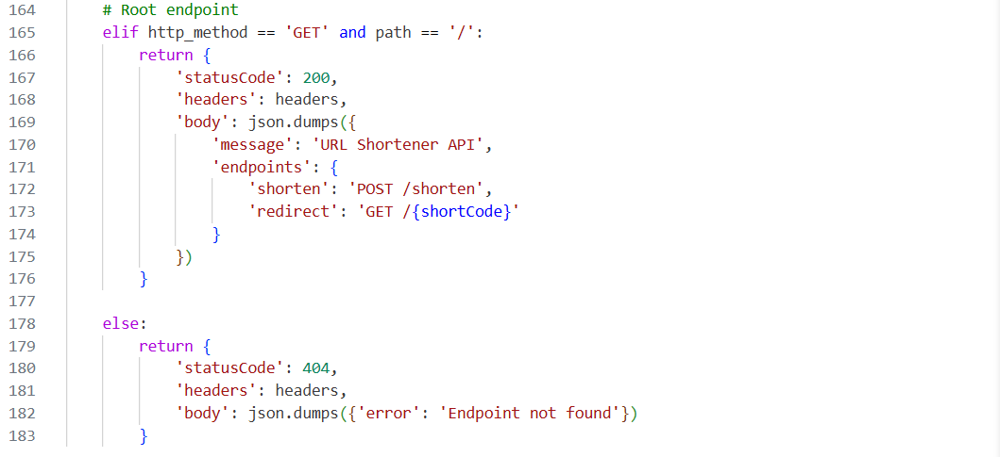


### API Gateway Configuration
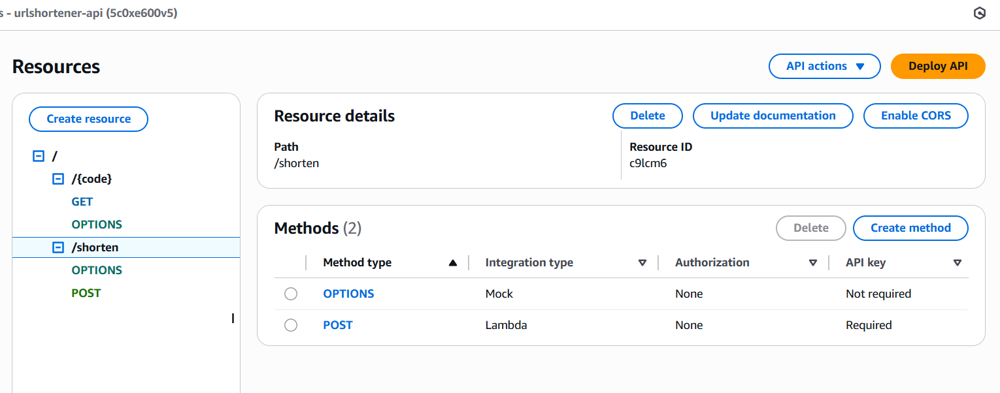

### Frontend UI
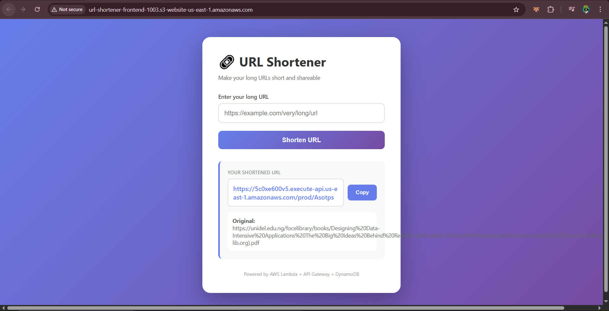
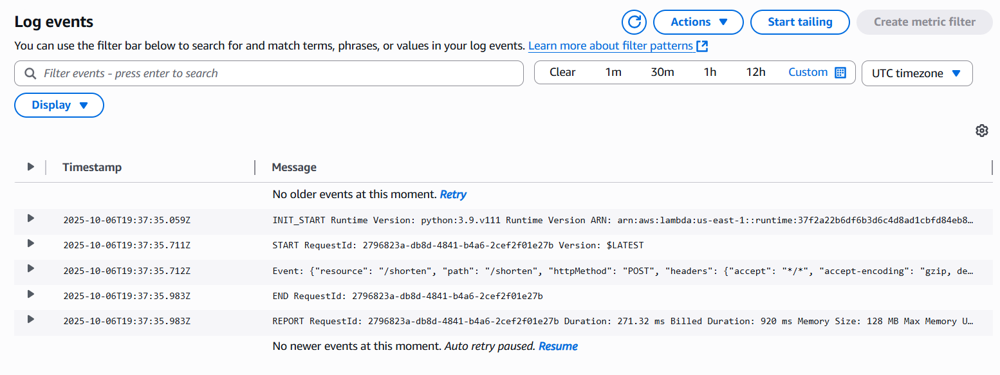

### Working Redirect
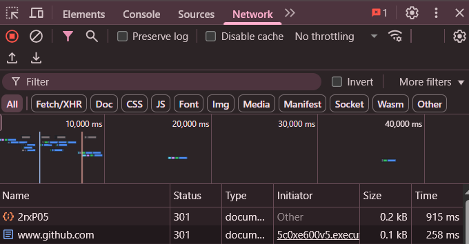

---

## 💡 Key Learnings

### Technical Skills
-  **Serverless Architecture** - Event-driven, auto-scaling compute
-  **RESTful API Design** - Proper HTTP methods, status codes, CORS
-  **NoSQL Data Modeling** - Single-table design with DynamoDB
-  **AWS Service Integration** - Lambda, API Gateway, DynamoDB, S3, IAM
-  **Error Handling** - Retry logic, collision resolution, graceful failures
-  **Security Best Practices** - IAM roles, least privilege, input validation

### Architecture Patterns
- Lambda proxy integration for API Gateway
- Conditional writes to prevent race conditions
- Atomic counters for analytics
- Static website hosting on S3

---

## 🔮 Future Enhancements

- [ ] **Custom Short Codes** - User-defined vanity URLs
- [ ] **Analytics Dashboard** - Visualize clicks, geography, devices
- [ ] **QR Code Generation** - Auto-generate QR codes for short URLs
- [ ] **Expiration/TTL** - Auto-delete old links
- [ ] **Rate Limiting** - API keys and usage quotas
- [ ] **Custom Domains** - Route 53 + CloudFront + ACM SSL
- [ ] **Authentication** - Cognito user pools for private links
- [ ] **Bulk URL Import** - Upload CSV for batch processing

---

## 💰 Cost Breakdown

**AWS Free Tier (First 12 months):**
- Lambda: 1M requests + 400,000 GB-seconds/month
- API Gateway: 1M requests/month
- DynamoDB: 25GB storage + 200M requests/month
- S3: 5GB storage + 20,000 GET requests/month

**Estimated Cost After Free Tier:**
- ~$0.50/month for 10,000 requests
- ~$5/month for 100,000 requests

**Comparison:** Bitly starts at $29/month

---

## 🔐 Security Considerations

- ✅ IAM roles with least privilege access
- ✅ Input validation (URL length, format)
- ✅ DynamoDB conditional writes (prevents overwrites)
- ✅ CORS properly configured
- ✅ CloudWatch logging enabled
- ⚠️ No authentication (demo mode)
- ⚠️ No rate limiting (would add API keys in production)

---

## 🐛 Known Limitations

- No user authentication (public demo)
- No rate limiting per IP
- HTTP only (would add CloudFront + SSL in production)
- Single region deployment (could add multi-region with Route 53)

---

## 📚 Resources & Documentation

- [AWS Lambda Documentation](https://docs.aws.amazon.com/lambda/)
- [API Gateway Developer Guide](https://docs.aws.amazon.com/apigateway/)
- [DynamoDB Best Practices](https://docs.aws.amazon.com/amazondynamodb/latest/developerguide/best-practices.html)
- [S3 Static Website Hosting](https://docs.aws.amazon.com/AmazonS3/latest/userguide/WebsiteHosting.html)

---

## 🤝 Contributing

This is a portfolio project, but suggestions are welcome!

1. Fork the repository
2. Create your feature branch (`git checkout -b feature/AmazingFeature`)
3. Commit your changes (`git commit -m 'Add some AmazingFeature'`)
4. Push to the branch (`git push origin feature/AmazingFeature`)
5. Open a Pull Request

---

## 👤 Author

**Utsav Khairnar**

- GitHub: [@utsav1033](https://github.com/utsav1033)
- Email: utsavkhairnar14@gmail.com

---

## ⭐ Acknowledgments

- Built as part of AWS Cloud Learning Path
- Inspired by Bitly and TinyURL
- Thanks to AWS for the generous Free Tier

---

<div align="center">

**If you found this project helpful, please give it a ⭐!**

Made with ❤️ using AWS Serverless

</div>
